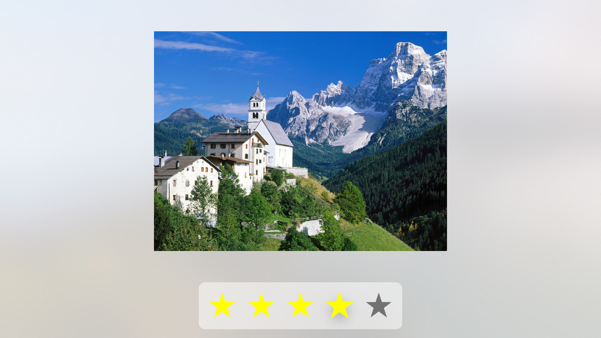

# WWRatingControl

Rating control for tvOS demoed at WWDC 2016 for session entitled [Focus interaction on tvOS](https://developer.apple.com/videos/play/wwdc2016/215/).

Project written in swift 2.2 with iOS target 9.3, though demo code was written in swift 3.0 and targetting iOS 10, other than that mostly the same.

What's most the `UIMotionEffectGroup` code snippet that can placed in an extension to easily add tilt interaction when view is in focus.

    extension UIMotionEffectGroup{
      static func motionEffectGroupForFocus() -> UIMotionEffectGroup {
          let horizontalAxisMotionEffect = UIInterpolatingMotionEffect(keyPath: "center.x", type: .TiltAlongHorizontalAxis)
          horizontalAxisMotionEffect.minimumRelativeValue = -8.0
          horizontalAxisMotionEffect.maximumRelativeValue = 8.0
        
          let verticalAxisMotionEffect = UIInterpolatingMotionEffect(keyPath: "center.y", type: .TiltAlongVerticalAxis)
          verticalAxisMotionEffect.minimumRelativeValue = -8.0
          verticalAxisMotionEffect.maximumRelativeValue = 8.0
        
          let motionEffectGroup = UIMotionEffectGroup()
          motionEffectGroup.motionEffects = [horizontalAxisMotionEffect, verticalAxisMotionEffect]
          return motionEffectGroup
      }
    }
